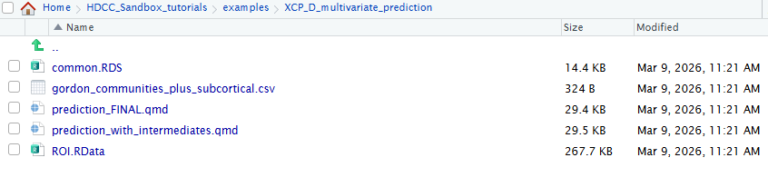
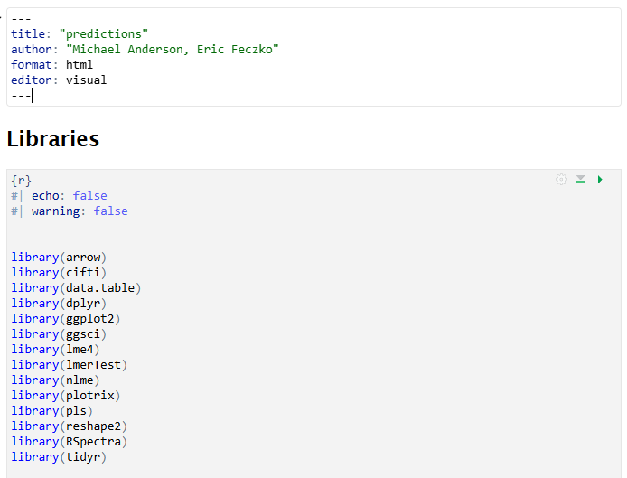

Example 4: XCP_D Output Multivariate Prediction
===============================================

Introduction
------------

XCP_D outputs produce resting-state functional connectivity matrices
that can be leveraged for subsequent analysis. Functional connectivity
is a marker of functional brain organization, which likely matures via
development. Therefore, measuring the developmental trajectory of
functional connectivity and how such trajectory may predict behavioral
outcomes like cognition, is of extreme importance for many users.
Unfortunately, functional connectivity data are extremely high
dimensional, and performing whole-brain multivariate models can be
resource intensive. Dimensionality reduction, when performed properly,
can dramatically reduce resources needed and enable analysis with
limited RAM and CPU cores. Here, users will learn best practices and
standards for dimensionality reduction, and develop longitudinal
predictive models of cognitive from parcellated whole-brain connectivity
data.

Module Objectives
-----------------

1. Users will learn how to load XCP_D parcellated connectivity outputs.

2. Users will learn how to perform dimensionality reduction separately
   on training data

3. Users will learn how to apply the reduced dimensions in a
   longitudinal predictive model of cognition

4. Users will learn how to evaluate the predicted outputs and visualize
   them

Walkthrough
-----------

1. | Return to your interactive sessions, you can do this by clicking on
     a new session in the dashboard and opening a new window. Instead of
     launching, click on the “My Interactive Sessions” highlighted in
     blue – it will open the link to your sessions page.
   | |image1|

2. | From your sessions, select your R studio server and launch it – if
     its already open, you can skip these steps. Dont worry if you
     accidentally relaunch, r studio servers are saved as images and are
     restored between sessions.
   | |image2|

3. | Navigate to the “XCP_D_multivariate_prediction” in the examples
     folder and select the prediction_FINAL.qmd file.
   | |image3|

4. | This will open the multivariate_prediction example, which can also
     be knitted as a PDF or html output. Here we will follow the steps
     in order.
   | |image4|

.. |image1| image:: HDCCmedia/module6/media/image1.png
   :width: 6.5in
   :height: 2.16667in
.. |image2| image:: HDCCmedia/module6/media/image2.png
   :width: 6.5in
   :height: 3.81944in

