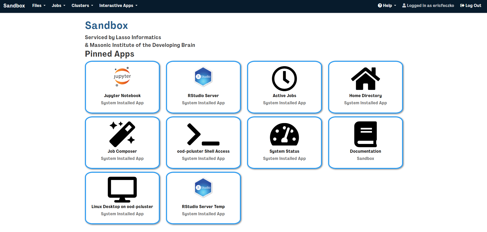
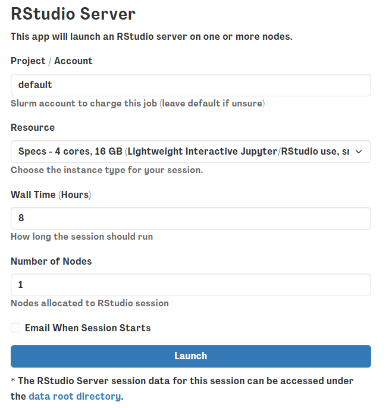
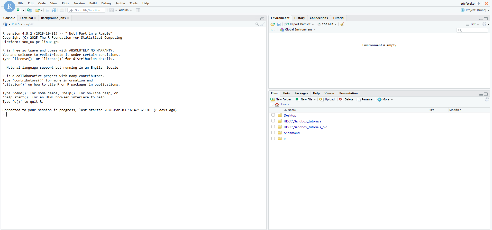
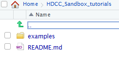
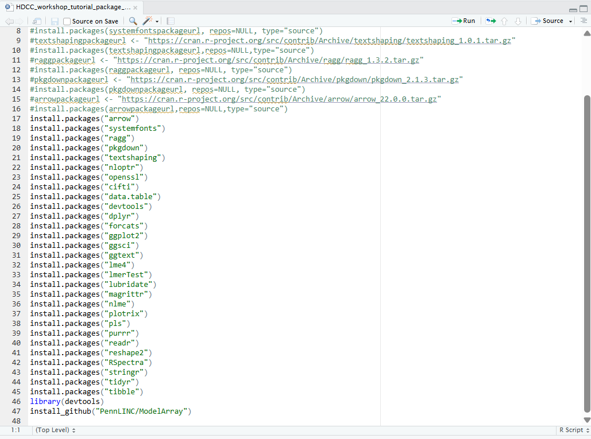

Example 1: R studio server install dependencies
===============================================

Introduction
------------

The R studio server enables users a stable R environment for conducting
analyses on the sandbox. The R studio server session is stored within
users home directories, enabling some permanence between R studio server
sessions. In order to leverage the R studio server, users will have to
install their own R packages. This module will walk users through basic
installation steps needed for this workshop.

Module Objectives
-----------------

1. Navigate and open an R studio server session on the sandbox platform

2. Open the install script provided in the downloaded github repository

3. Start installing the R packages needed for subsequent modules

Walkthrough
-----------

1. | Return to the sandbox dashboard and select the R studio server
     session
   | |image1|

2. | This will open a window requesting optional resources and tools,
     for now we can leave this blank, make sure to have requested at
     least 2 hours for the session.
   | |image2|

3. | This will open an rstudio session. Go ahead and click on it and
     you’ll have an R studio session loaded like this
   | |image3|

4. | In the lower right hand corner, navigate to the
     “HDCC_Sandbox_tutorial/examples/install_dependencies” and open the
     R script
   | |image4| |image5| |image6|

5. | This will open a script on the left hand side – go ahead and just
     run the script. Installation time is about 10-20 minutes. We will
     do :doc:`BIBSnet_volumetric_analysis_on_jupyter_notebooks` in the
     meantime.
   | |image7|

