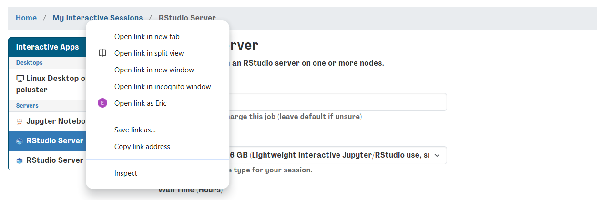
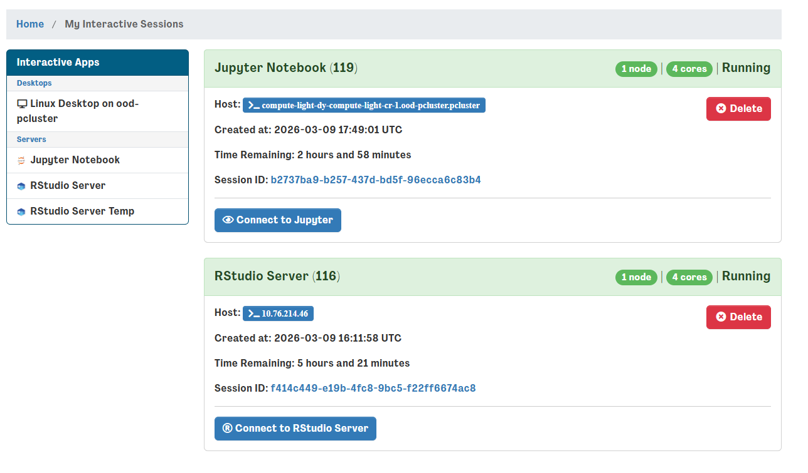
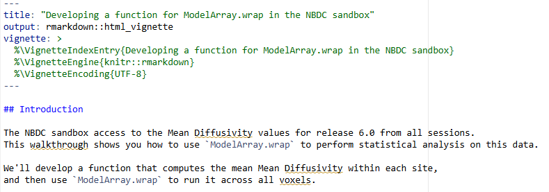

Example 3: diffusion univariate statistical testing
===================================================

Introduction
------------

White matter changes through development may be indicative of maturation
of structural connections between brain regions. Diffusion imaging can
measure white matter trajectory and density. Therefore, we can examine
the maturation of structural connections by analyzing the developmental
trajectory of diffusion imaging measures. Unfortunately, diffusion
datasets are quite large, and computer systems may lack sufficient RAM
and CPU resources to model across the whole brain. Here, users will
learn how to use HDF5 outputs to load only the data needed for analysis,
which minimizes the resource footprint and makes such analysis more
accessible.

Module Objectives
-----------------

1. Users will learn how to use diffusion imaging outputs from the ABCD
   study.

2. Users will learn how to load HDF5 data and develop models using the
   ModelArray package.

3. Users will learn how to use R to perform statistical analysis of
   variance.

Walkthrough
-----------

1. | Return to your interactive sessions, you can do this by clicking on
     a new session in the dashboard and opening a new window. Instead of
     launching, click on the “My Interactive Sessions” highlighted in
     blue – it will open the link to your sessions page.
   | |image1|

2. | From your sessions, select your R studio server and launch it – if
     its already open, you can skip these steps. Dont worry if you
     accidentally relaunch, r studio servers are saved as images and are
     restored between sessions.
   | |image2|

3. | Selecting the R studio server, navigate to the
     qsiprep_bigdata_univariate_analysis folder and open the
     corresponding R markdown (“.Rmd”) file.
   | |image3|

4. | This will open the R markdown file in the top left corner – the
     file can be “knitted” into an html output. For the HDCC tutorial,
     we will run through the steps instead.
   | |image4|

5. After completing this tutorial we will follow with
   :doc:`XCP_D_output_multivariate_prediction` next.

