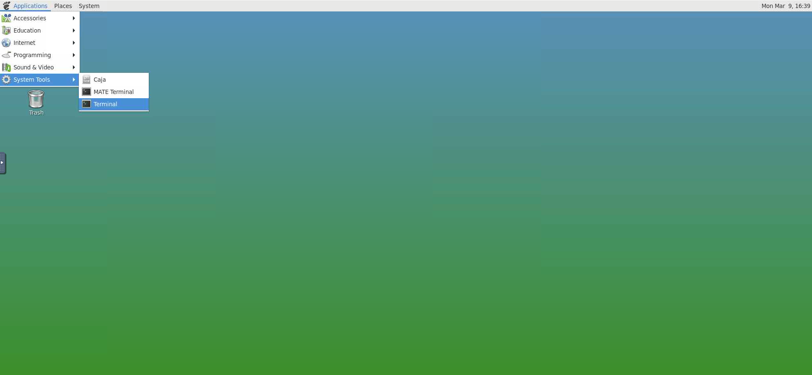
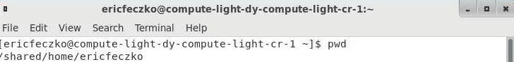
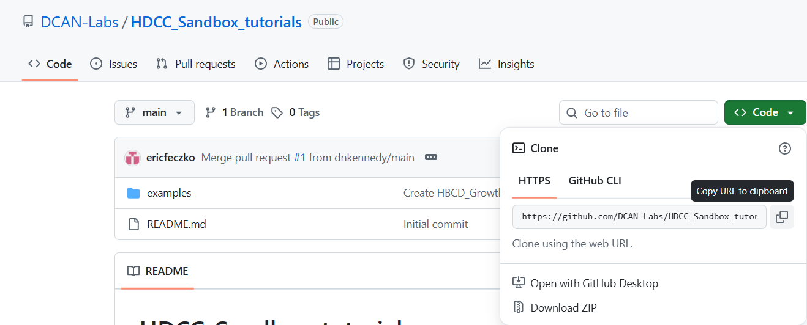
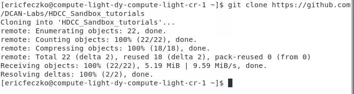
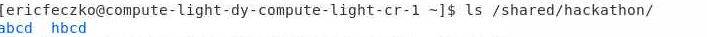
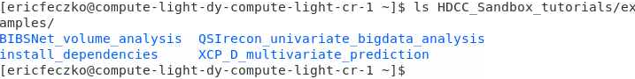

Using the desktop on the sandbox
================================

Introduction
------------

The virtual desktop on the sandbox provides users with a flexible
platform for analyzing HBCD and ABCD data securely. In addition, the
desktop provides terminal access, enabling users to pull down
repositories and external programs onto their home directory within the
sandbox.

Module Objectives
-----------------

1. Navigate the virtual desktop

2. Open a terminal window and examine the structure of the sandbox

3. Pull down a repository from github

4. Explore the available data using the terminal

Walkthrough
-----------

1. | The virtual environment provides a graphical user interface (GUI)
     that allows us to navigate the sandbox. For now, let us open a
     terminal using the “applications” tab and selecting “system tools”
     and then “Terminal” underneath.
   | |image1|

2. This will open a terminal for working directly on the command line.
   If you type “pwd” for present working directory, we can see that you
   are in your own home workspace. |image2|

3. Using a new browser tab, navigate to
   https://github.com/DCAN-Labs/HDCC_Sandbox_tutorials where the
   tutorials for the HDCC are located. If you select the green “code”
   button, you can find the path for cloning the repository. Go ahead
   and copy the URL to your clipboard. |image3|

4. Going back to the terminal, go ahead and type “git clone” add a space
   and paste the path into the terminal. This will pull the repository
   from github onto the sandbox. |image4|

5. | Now, we will want to see what data is on the sandbox environment.
     This can be found in the “/shared” folder on the root system. Go
     ahead and list the contents of the `/shared/hackathon` folder,
     and you’ll see folders for the ABCD and HBCD data available for the
     workshop.
   | |image5|

6. If you list the contents of “~/HDCC_Sandbox_tutorials/examples”
   you’ll see the four examples we’ll be tackling today. We will be
   starting with :doc:`loading_the_R_studio_server_and_setup` next.

..

   |image6|

